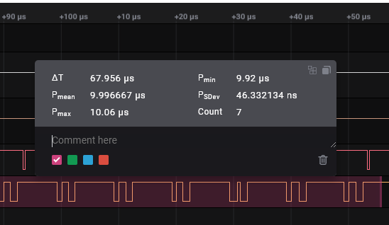

# Burst Stats
**Burst Stats** is a Logic2 digital measurement
extension that adds simple
periodic burst statistics to digital measurements. This is useful for checking
sample timing of an ADC by looking at the SPI clock activity bursts for example
and similar processes where a burst of activity is a good proxy for an event of
interest.

Burst Stats can also be used to generate simple cycle period stats for pulse
trains. Set _kMinPeriod_ (see below) to somewhat less than the minimum expected
cycle time and _kWantedState_ to _None_.

Two user parameters are embedded in BurstStats.py. __*kMinPeriod is critical
to the use of Burst Stats*__ and kWantedState may be useful in some cases.
__*See instructions below*__ for use of these parameters.

## Instructions

### Installation
Install **BurstStats** by clicking "Install" on the **Burst Stats** entry in the
Extensions panel.

### Measurement management
To add a measurement you can:

1. Click on the Measurements "+" icon in the "Annotations panel", then click on
    the "Add Measurement Ctrl+G" popup button, then drag over the digital data
    you want to measure, or
2. Press Ctrl+G then drag over the digital data you want to measure, or
3. Shift drag over the digital data you want to measure

Dismiss the measurement popup dialog by clicking outside any selection.

Show the measurement popup dialog for a selection by clicking on the selection.

You may also view measurement data by opening the measurement pane by clicking
on the ruler icon in the right hand side panel buttons area.

### User Parameters

Two user parameters are embedded in the Python source at the top of the file for
**Burst Stats**:

- **kMinPeriod**: the "idle" period between bursts. This is used to identify
the bursts of interest by identifying the minimum idle period between them.
- **kWantedState**: is used to control significant edge detection. Usually
this isn't important, but it can help where a burst is deemed to start on either
a rising (set True) or falling (set False) edge. The default value is None
(either edge).

Unfortunately at present these can only be manipulated through the extension
source code. On Windows the code may be found in
_%appdata%\Logic\Marketplace\xxx_. 'xxx' is a number assigned by Logic2 when the
extension is installed (64 in my case). On Linux the code directory is
_~/.config/Logic/Marketplace/xxx/_. I'd appreciate other users letting me know
where Logic2 puts extension source on other systems.

**BurstStats** must be disabled then enabled for new settings to take effect.

### Feedback and Issues

Issues and feature requests should be raised on GitHub using
https://github.com/GrandFatherADI/BurstStats/issues/new.

Public feedback can be provided on Saleae's [Extensions discussion
forum](https://discuss.saleae.com/c/hlas-measurements-other/9).
